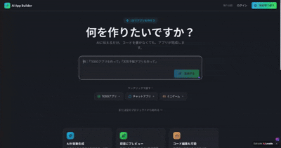

# ⚡ AI App Builder with Live Preview

Build full apps with AI and see the result instantly — no setup, no install.

👉 **Try it now:** https://chat-alive-code.lovable.app/

---

## 🚀 What is this?

This is an AI-powered app builder that lets you:

* 🧠 Generate apps using natural language
* ⚡ Instantly preview the result
* 💻 Run everything in your browser
* 🔥 Skip setup, configs, and boilerplate

Just type → generate → see it live.

---

## 🎥 Demo

> Replace this with your actual demo GIF (VERY IMPORTANT 🚨)

---

## ✨ Features

* ⚡ Real-time app generation
* 👀 Live preview panel
* 🧠 AI-powered coding assistant
* 📦 No installation required
* 🌐 Works as a PWA

---

## 🛠 Tech Stack

* React
* JavaScript
* AI API (OpenAI / etc)
* Lovable

---

## 💡 Example Use Cases

* Build a TODO app in seconds
* Prototype ideas instantly
* Learn coding interactively
* Generate UI components with AI

---

## 🔥 Why this is cool

Most AI tools generate code.

👉 This one shows it **instantly working**.

That changes everything.

---

## ⭐ Support

If you like this project:

* ⭐ Star this repo
* 🐦 Share on Twitter/X
* 🍴 Fork and build your own

---

## 🚧 Roadmap

* [ ] Better UI generation
* [ ] More templates
* [ ] Export as real apps
* [ ] GitHub integration

---

## 📬 Feedback

Open an issue or reach out — feedback is welcome!

---

## ⚠️ Note

This project is experimental and evolving.

---

## 🧠 Inspiration

Built for developers who want to move **fast**.

---

# ⭐ Star this repo to support the project!
# ai-app-builder-live-preview
